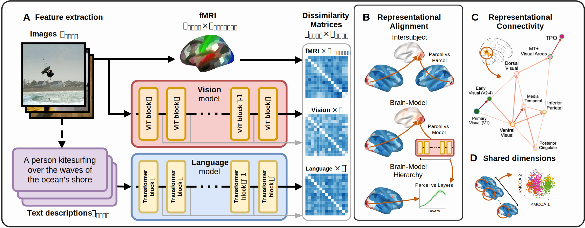

# convergent-transformations

Code of the paper *Convergent transformations of visual representation in brains and models*. P. Marcos-Manchón and L. Fuentemilla (*Under review*).

Methods overview
----------------

**(A) Feature Extraction**. For each image-text stimulus, we generated parallel representations. Single-trial fMRI responses were aggregated within cortical parcelsto create vector representations of the brain's response to scene information. Concurrently, layer-wise activations from pre-trained vision (ViT) and language (Transformer) models were extracted to obtain scene representations across the model hierarchies. Both brain and model vectors were used to compute Representational Dissimilarity Matrices (RDMs). \
**(B) Representational Alignment**. Representational Similarity Analysis (RSA) was used to compare RDMs, mapping correspondences between brain parcels and model layers and assessing inter-subject consistency. \
**(C) Representational Connectivity**. RSA comparisons between brain parcels yielded a network of shared similarity. Analyzing this network revealed the hierarchical flow of information and identified key representational hubs within the visual streams. \
**(D) Shared Dimensions**. Within the identified hubs, Kernel multi-view Canonical Correlation Analysis (KMCCA) was used to isolate a subspace of stimulus dimensions shared across participants. This analysis links the representational axes to semantic properties of the scene content.

Code
---
The code for our paper is currently under review and will be released in this repository as soon as possible.
