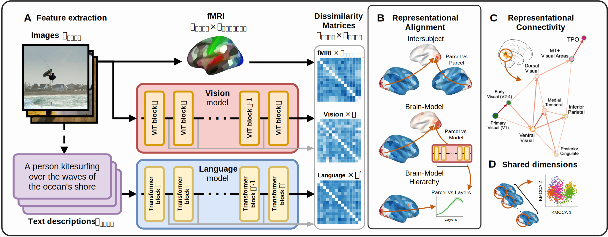

# Convergent transformations of visual representation in brains and models

[](https://arxiv.org/abs/2507.13941) [](https://www.python.org/downloads/release/python-3100/)

## Abstract

A fundamental question in cognitive neuroscience is what shapes visual perception: the external world's structure or the brain's internal architecture. Although some perceptual variability can be traced to individual differences, brain responses to naturalistic stimuli evoke similar activity patterns across individuals, suggesting a convergent representational principle. Here, we test if this stimulus-driven convergence follows a common trajectory across people and deep neural networks (DNNs) during its transformation from sensory to high-level internal representations. We introduce a unified framework that traces representational flow by combining inter-subject similarity with alignment to model hierarchies. Applying this framework to three independent fMRI datasets of visual scene perception, we reveal a cortex-wide network, conserved across individuals, organized into two pathways: a medial-ventral stream for scene structure and a lateral-dorsal stream tuned for social and biological content. This functional organization is captured by the hierarchies of vision DNNs but not language models, reinforcing the specificity of the visual-to-semantic transformation. These findings show a convergent computational solution for visual encoding in both human and artificial vision, driven by the structure of the external world.


## Methods overview



**(A) Feature Extraction**. For each image-text stimulus, we generated parallel representations. Single-trial fMRI responses were aggregated within cortical parcelsto create vector representations of the brain's response to scene information. Concurrently, layer-wise activations from pre-trained vision (ViT) and language (Transformer) models were extracted to obtain scene representations across the model hierarchies. Both brain and model vectors were used to compute Representational Dissimilarity Matrices (RDMs). \
**(B) Representational Alignment**. Representational Similarity Analysis (RSA) was used to compare RDMs, mapping correspondences between brain parcels and model layers and assessing inter-subject consistency. \
**(C) Representational Connectivity**. RSA comparisons between brain parcels yielded a network of shared similarity. Analyzing this network revealed the hierarchical flow of information and identified key representational hubs within the visual streams. \
**(D) Shared Dimensions**. Within the identified hubs, Kernel multi-view Canonical Correlation Analysis (KMCCA) was used to isolate a subspace of stimulus dimensions shared across participants. This analysis links the representational axes to semantic properties of the scene content.


## Code

The code is organized into the following directories:

- [convergence/](./convergence/)  <br/>
  Python package with utility functions used by scripts and notebooks.
- [1_dataset_preparation/](./1_dataset_preparation/) <br/>
  Scripts and instructions for downloading and organizing fMRI datasets (NSD, BOLD5000, THINGS‑fMRI) and generating trial/ROI indexes.
- [2_model_extraction/](./2_model_extraction/) <br/>
  Scripts to extract layer‑wise activations from pre‑trained vision and language models.
- [3_alignment/](./3_alignment/) <br/>
  Scripts to compute subject–subject and subject–model RSA for the main analyses.
- [4_other_alignments/](./4_other_alignments)  <br/>
  Scripts for supplementary and control alignments (e.g., untrained models, tokenizer controls).
- [5_notebooks/](./5_notebooks)  <br/>
  Jupyter notebooks reproducing all figures and analyses in the manuscript.
- [6_legacy_scripts/](./6_legacy_scripts)  <br/>
  Early prototype scripts.
- [7_legacy_notebooks/](./7_legacy_notebooks)  <br/>
  Early and exploratory notebooks.


## Data

This work uses the Natural Scenes Dataset (NSD), BOLD5000, and THINGS‑fMRI.  
Preprocessing scripts (1_dataset_preparation → 4_other_alignments) generate the `derivatives/` folder, which holds all RDMs and alignment outputs. See `derivatives/README.md` for details. The notebooks in `5_notebooks` uses these derivatives files to produce figures and statistics.


## Installation

We recommend Python 3.10. Create a virtual environment and install dependencies:

```bash
python -m venv venv
source venv/bin/activate     # macOS/Linux
python -m pip install --upgrade pip
pip install -r requirements.txt

# Install the convergence utility package
pip install -e .
```

> Note: The live installation of the `convergence` package does not automatically install dependencies listed in `requirements.txt`. This allows you to selectively install dependencies depending on the scripts or notebooks you plan to run.

**GPU support:** Alignment scripts are optimized for PyTorch with CUDA (tested on A40, 48 GB). Install the appropriate `torch` build matching your CUDA drivers if you plan to run these scripts.


## Acknowledgements

This work was supported by the Spanish Ministerio de Ciencia, Innovación y Universidades / Agencia Estatal de Investigación (AEI) under PID2022‑140426NB (co‑funded by ERDF). We thank the CERCA Programme / Generalitat de Catalunya for institutional support.


## Citation

If you find the code useful for your research, please cite our preprint

> Marcos‑Manchón, P., & Fuentemilla, L. (2025). Convergent transformations of visual representation in brains and models (arXiv preprint). Retrieved from [https://arxiv.org/abs/2507.13941](https://arxiv.org/abs/2507.13941)

BibTeX entry:
```bibtex
@misc{marcosmanchon2025,
  title        = {Convergent transformations of visual representation in brains and models},
  author       = {Marcos‑Manchón, Pablo and Fuentemilla, Lluís},
  year         = {2025},
  eprint       = {2507.13941},
  archivePrefix= {arXiv},
  primaryClass = {q‑bio.NC},
  url          = {https://arxiv.org/abs/2507.13941},
}
```

If you use parts of the code related to model‑feature extraction or CKA alignment, please also cite:
Huh, M., Cheung, B., Wang, T., & Isola, P. (2024). *The Platonic Representation Hypothesis*. ICLR. (Code: [https://github.com/minyoungg/platonic-rep/](https://github.com/minyoungg/platonic-rep/)).

