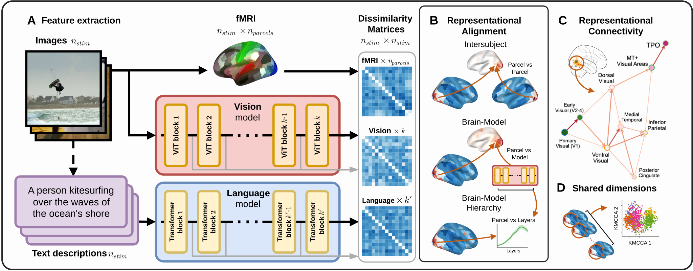

# Shared representations in brains and models reveal a two-route cortical organization during scene perception

[](https://arxiv.org/abs/2507.13941) [](https://www.python.org/downloads/release/python-3100/)

## Abstract

The brain transforms visual inputs into high-dimensional cortical representations that support diverse cognitive and behavioral goals. Characterizing how this information is organized and routed across the human brain is essential for understanding how we process complex visual scenes. Here, we applied representational similarity analysis to 7T fMRI data collected during natural scene viewing. We quantified representational geometry shared across individuals and compared it to hierarchical features from vision and language neural networks across model layers. By integrating these comparisons with representational connectivity between cortical regions, we identified two distinct processing routes: a ventromedial pathway specialized for scene layout and environmental context, and a lateral occipitotemporal pathway selective for animate content. Vision models aligned with shared structure in both routes, whereas language models corresponded primarily with the lateral pathway and showed negative alignment in early visual and ventral cortex. These findings refine classical visual-stream models by revealing a distributed cortical network with separable representational routes for context and animate content during scene perception.


## Methods overview



**(A) Feature Extraction**. For each image-text stimulus, we generated parallel representations. Single-trial fMRI responses were aggregated within cortical parcelsto create vector representations of the brain's response to scene information. Concurrently, layer-wise activations from pre-trained vision (ViT) and language (Transformer) models were extracted to obtain scene representations across the model hierarchies. Both brain and model vectors were used to compute Representational Dissimilarity Matrices (RDMs). \
**(B) Representational Alignment**. Representational Similarity Analysis (RSA) was used to compare RDMs, mapping correspondences between brain parcels and model layers and assessing inter-subject consistency. \
**(C) Representational Connectivity**. RSA comparisons between brain parcels yielded a network of shared similarity. Analyzing this network revealed the hierarchical flow of information and identified key representational hubs within the visual streams. \
**(D) Shared Dimensions**. Within the identified hubs, Kernel multi-view Canonical Correlation Analysis (KMCCA) was used to isolate a subspace of stimulus dimensions shared across participants. This analysis links the representational axes to semantic properties of the scene content.


## Code

The code is organized into the following directories:

- [convergence/](./convergence/)  <br/>
  Python package with utility functions used by scripts and notebooks.
- [1_dataset_preparation/](./1_dataset_preparation/) <br/>
  Scripts and instructions for downloading and organizing fMRI datasets (NSD, BOLD5000, THINGS‑fMRI) and generating trial/ROI indexes.
- [2_model_extraction/](./2_model_extraction/) <br/>
  Scripts to extract layer‑wise activations from pre‑trained vision and language models.
- [3_alignment/](./3_alignment/) <br/>
  Scripts to compute subject–subject and subject–model RSA for the main analyses.
- [4_other_alignments/](./4_other_alignments)  <br/>
  Scripts for supplementary and control alignments (e.g., untrained models, tokenizer controls).
- [5_notebooks/](./5_notebooks)  <br/>
  Jupyter notebooks reproducing all figures and analyses in the manuscript.
- [6_revision/](./6_revision)  <br/>
  Scripts for generating additional data for the manuscript revision.
- [7_revision/](./7_revision)  <br/>
  More scripts and notebooks for the revision.

## Data

This work uses the Natural Scenes Dataset (NSD), BOLD5000, and THINGS‑fMRI.  
Preprocessing scripts (1_dataset_preparation → 4_other_alignments) generate the `derivatives/` folder, which holds all RDMs and alignment outputs. See `derivatives/README.md` for details. The notebooks in `5_notebooks` uses these derivatives files to produce figures and statistics.

Derivatives files already generated can be downloaded in from [https://doi.org/10.6084/m9.figshare.30753239](https://doi.org/10.6084/m9.figshare.30753239).


## Installation

We recommend Python 3.10. Create a virtual environment and install dependencies:

```bash
python -m venv venv
source venv/bin/activate     # macOS/Linux
python -m pip install --upgrade pip
pip install -r requirements.txt

# Install the convergence utility package
pip install -e .
```

> Note: The live installation of the `convergence` package does not automatically install dependencies listed in `requirements.txt`. This allows you to selectively install dependencies depending on the scripts or notebooks you plan to run.

**GPU support:** Alignment scripts are optimized for PyTorch with CUDA (tested on A40, 48 GB). Install the appropriate `torch` build matching your CUDA drivers if you plan to run these scripts.


## Acknowledgements

This work was supported by the Spanish Ministerio de Ciencia, Innovación y Universidades / Agencia Estatal de Investigación (AEI) under PID2022‑140426NB (co‑funded by ERDF). We thank the CERCA Programme / Generalitat de Catalunya for institutional support.


## Citation

If you find the code useful for your research, please cite our preprint

> Marcos‑Manchón, P., & Fuentemilla, L. (2025). Shared representations in brains and models reveal a two-route cortical organization during scene perception (arXiv preprint). Retrieved from [https://arxiv.org/abs/2507.13941](https://arxiv.org/abs/2507.13941)

BibTeX entry:
```bibtex
@misc{marcosmanchon2025,
  title        = {Shared representations in brains and models reveal a two-route cortical organization during scene perception},
  author       = {Marcos‑Manchón, Pablo and Fuentemilla, Lluís},
  year         = {2025},
  eprint       = {2507.13941},
  archivePrefix= {arXiv},
  primaryClass = {q‑bio.NC},
  url          = {https://arxiv.org/abs/2507.13941},
}
```

If you use parts of the code related to model‑feature extraction or CKA alignment, please also cite:
Huh, M., Cheung, B., Wang, T., & Isola, P. (2024). *The Platonic Representation Hypothesis*. ICLR. (Code: [https://github.com/minyoungg/platonic-rep/](https://github.com/minyoungg/platonic-rep/)).


